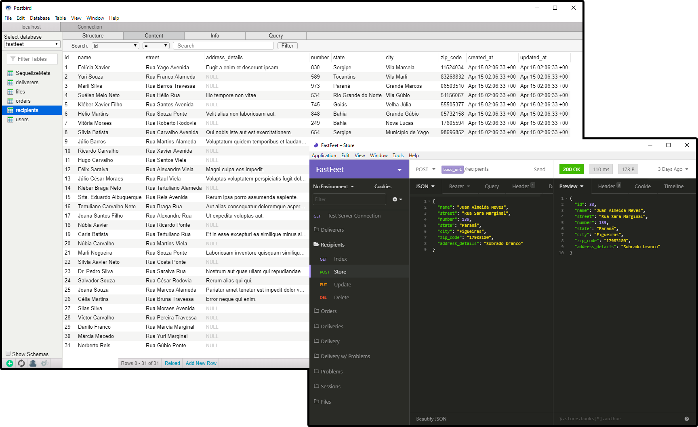

<p align="center">
  
</p>

<p align="center">
  FastFeet's backend is an RESTful API written in TypeScript, using SQL and NoSQL databases and a task queue to send warning mails to deliverers! :open_file_folder:
</p>

## Index
- [Getting Started][100]
- [Notes][101]
- [Built With][102]

[100]: #getting-started
[101]: #notes
[102]: #built-with

## Getting Started
Ensure that you followed the getting started section on the root of FastFeet project.

*Please, stick to only one package manager to run all commands on the application.*

### Configuration
This project uses 3 docker images as database together with a mailing platform. Configuring it is crucial to run all pieces of FastFeet project.

#### Databases
1. install [Docker][200]
   1. If you are on windows, don't forget that the newst version of Docker uses Hyper-V and some Android Emulators still uses Virtual Box what will cause a problem because both can't run at the same time. In this scenario you can use this [docker version][201] that uses Virtual Box.
2. Install [PostgreSQL image][202]
   1. run `docker run --name pg-fasfeet -e POSTGRES_PASSWORD=docker -p 5432:5432 -d postgres`
3. Install [Mongodb image][203]
   1. run `docker run --name mongo-fastfeet -p 27017:27017 -d -t mongo`
4. Install [Redis image][204]
   1. run `docker run --name redis-fastfeet -p 6379:6379 -d -t redis:alpine`

[200]: https://www.docker.com/
[201]: https://docs.docker.com/toolbox/toolbox_install_windows/
[202]: https://hub.docker.com/_/postgres
[203]: https://hub.docker.com/_/mongo
[204]: https://hub.docker.com/_/redis/

#### Mailing
1. Go to [mailtrap][205] and create an account.
2. Create an Inbox with any name that reminds you this project.
3. On the credentials tab, select Nodemailer under the Node group.
4. Save the configuration code. It will be used on the next step.

[205]: https://mailtrap.io/

#### Node environmental variables
1. Copy the `.env.example` file on the root of this folder with the name `.env`
2. Full fill all variable lines with your respective configuration.
   1. Don't forget, those values change based on how you configured you docker images and mailing.

*Exemple of `.env` full filled*
```
APP_URL=http://localhost:3333
NODE_ENV=development

# Auth

AUTH_SECRET=123

# Database

DB_HOST=localhost
DB_USER=postgres
DB_PASS=docker
DB_NAME=fastfeet

# Mongo

MONGO_URL=mongodb://localhost:27017/fastfeet

# Redis

REDIS_HOST=127.0.0.1
REDIS_POST=6379

# Mail

MAIL_HOST=smtp.mailtrap.io
MAIL_PORT=123
MAIL_USER=abcde
MAIL_PASS=abc123
```

### Initializing project
To start FastFeet's backend you will need first to install all dependencies, then you can run it's core project and the task queue.

*Do not forget to start all databases everytime that you want to run FastFeet. To do it run: `docker start image-name`*

#### NPM
1. run `npm install`
2. run `npm run dbconfig`
3. run `npm run dev`
4. Open a new terminal tab, or instance. Don't close the one running step 1.
5. run `npm run queue`

#### Yarn
1. run `yarn`
2. run `yarn dbconfig`
3. run `yarn dev`
4. Open a new terminal tab, or instance. Don't close the one running step 1.
5. run `yarn queue`

Now, you can start using the application! If you want to get some initial data to interact with you can follow the steps on the next section.

### Interact with the API (optional)
To interact with the API without you can use an API request builder, and some GUI databases clients. Here some options:

- [Postbird][206]
- [MongoDB Compass][207]
- [Insomnia][208]

[206]: https://www.electronjs.org/apps/postbird
[207]: https://www.mongodb.com/products/compass
[208]: https://insomnia.rest/

### Seeding (optional)
To seed all your application you will need to run the `seeds` script. It will undo all migrations and collections, create them again and generate all seeds.

#### NPM
1. run `npm run seeds`

#### Yarn
1. run `yarn seeds`

## Notes
- This is the only part of the FastFeet project that is built with TypeScript. It was a challenge I did to myself to learn TS while creating something interesting.

## Built With

### Core
- [express][400]
- [nodemon][401]
- [jsonwebtoken][402]
- [multer][403]
- [nodemailer][404]
- [bee-queue][405]
- [sucrase][406]
- [typescript][407]

[400]: https://expressjs.com/
[401]: https://nodemon.io/
[402]: https://github.com/auth0/node-jsonwebtoken
[403]: https://github.com/expressjs/multer
[404]: https://nodemailer.com/about/
[405]: https://github.com/bee-queue/bee-queue
[406]: https://github.com/alangpierce/sucrase
[407]: https://www.typescriptlang.org/

### Linting & Style Guides
- [eslint][408]
- [prettier][409]
- [airbnb JS Style Guide][410]

[408]: https://eslint.org/
[409]: https://prettier.io/
[410]: https://github.com/airbnb/javascript

### Debug
- [express-async-errors][411]
- [youch][412]

[411]: https://github.com/davidbanham/express-async-errors
[412]: https://github.com/poppinss/youch

### Database
- [sequelize][413]
- [mongoose][414]
- [mongo-seeding-cli][415]
- [postgresql][416]
- [mongodb][417]
- [redis][418]

[413]: https://sequelize.org/
[414]: https://mongoosejs.com/
[415]: https://github.com/pkosiec/mongo-seeding/tree/master/cli
[416]: https://www.postgresql.org/
[417]: https://www.mongodb.com/
[418]: https://redis.io/

### Utils
- [dotenv][419]
- [faker.js][420]
- [bcryptjs][421]
- [cors][422]
- [yup][423]

[419]: https://github.com/motdotla/dotenv
[420]: https://github.com/marak/Faker.js/
[421]: https://github.com/dcodeIO/bcrypt.js
[422]: https://github.com/expressjs/cors
[423]: https://github.com/jquense/yup
