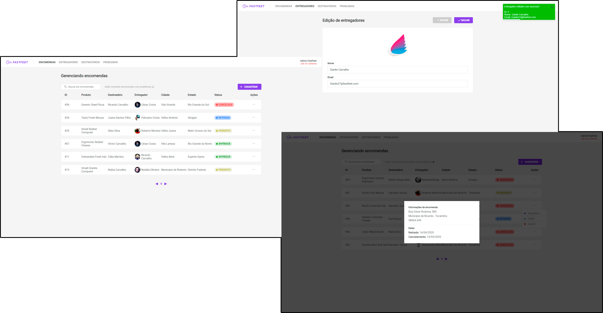

  

  FastFeet's frontend is an administration platform to manage orders, deliverers and recipients! Capable of filtering, listing, registering, updating and deleting. :computer:

## Index
- [Getting Started][100]
- [Notes][101]
- [Built With][102]

[100]: #getting-started
[101]: #notes
[102]: #built-with

## Getting Started
In order to use FastFeet's frontend you will need to configure the [backend][201] first.

*Please, stick to only one package manager to run all commands on the application.*

### NPM
If your are using npm you will need to run `npm install` and wait it to finish installing all the dependencies, after that you can run `npm start` to use FastFeet admin portal.

### Yarn
If your are using yarn you will need to run `yarn` and wait it to finish installing all the dependencies, after that you can run `npm  start` to use FastFeet admin portal.

### Usage
Now with the application running you can start using it! To access all pages your user login will be:

> email: `admin@fasfeet.com`\
> password: `123456`

*As this app was built with [create-react-app][202] it has all scripts generate by CRA available.*

[201]: https://github.com/f-maia/-Rocketseat-FastFeet/tree/master/backend
[202]: https://github.com/facebook/create-react-app

## Notes
- Based on the project proposal you are not able to create an admin.

## Built With

### Core
- [react][300]
- [prop-types][301]
- [redux][302]
- [redux-saga][303]
- [redux-persist][304]
- [react-router-dom][305]

[300]: https://reactjs.org/
[301]: https://github.com/facebook/prop-types
[302]: https://redux.js.org/
[303]: https://redux-saga.js.org/
[304]: https://github.com/rt2zz/redux-persist
[305]: https://reacttraining.com/react-router/web/guides/quick-start

### Linting & Style Guides
- [eslint][306]
- [prettier][307]
- [airbnb JS Style Guide][308]

[306]: https://eslint.org/
[307]: https://prettier.io/
[308]: https://github.com/airbnb/javascript

### Debug
- [reactotron][309]
- [reactotron-redux][310]
- [reactotron-redux-saga][311]

[309]: https://github.com/infinitered/reactotron
[310]: https://github.com/infinitered/reactotron-redux
[311]: https://github.com/infinitered/reactotron-redux-saga

### Styles
- [styled-components][312]
- [polished][313]

[312]: https://styled-components.com/
[313]: https://github.com/styled-components/polished

### Utils
- [axios][314]
- [formik][315]
- [date-fns][316]
- [yup][317]
- [immer][318]

[314]: https://github.com/axios/axios
[315]: https://jaredpalmer.com/formik/docs/overview
[316]: https://date-fns.org/
[317]: https://github.com/jquense/yup
[318]: https://github.com/immerjs/immer

### Components
- [react-select][319]
- [react-toastify][320]
- [react-icons][321]
- [react-input-mask][322]

[319]: https://react-select.com/home
[320]: https://github.com/fkhadra/react-toastify
[321]: https://react-icons.netlify.app/#/
[322]: https://github.com/sanniassin/react-input-mask
