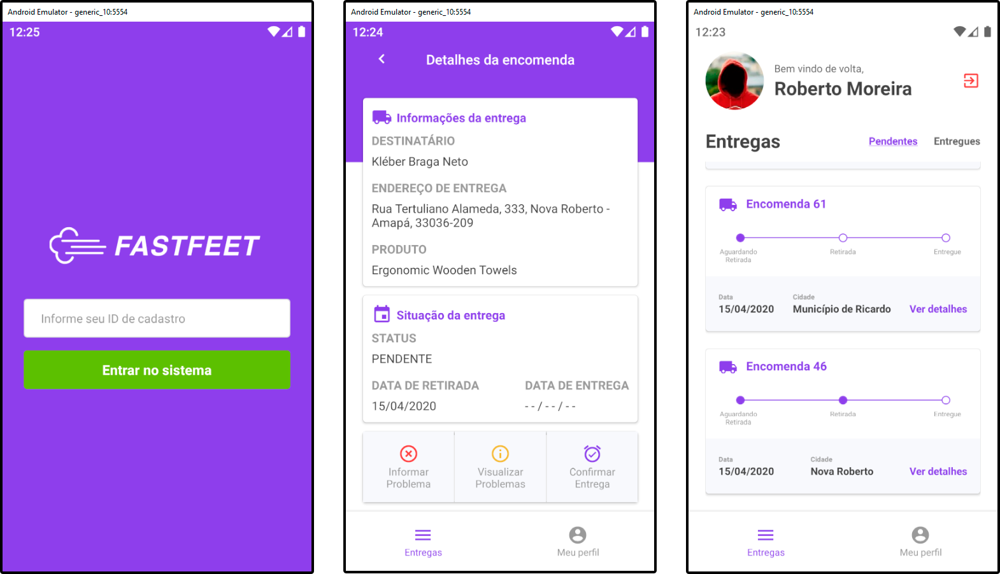

  

  FastFeet's mobile is an application focused on deliverers. They are able to view all theirs deliveries, designated, on progress and completed ones, register and view problems and withdraw and confirm deliveries with a photo! :iphone:

## Index
- [Getting Started][100]
- [Notes][101]
- [Built With][102]

[100]: #getting-started
[101]: #notes
[102]: #built-with

## Getting Started
To use FastFeet's mobile app you will need to setup an emulator or a real device to aceept it. To do so you can use one of the following guides.

*This project is mainly focused on Android. For more information check the notes section.*

### Development Environment
Please, follow the [react native guide][200] referent to your platform, it will guide you through most of the configurations options available today.

*If you speak portuguese I will recomend you to use [the Rocketseat guide][201] it's the best one I could find on the web and covers all 3 majors computer OS and both Android and iOS for emulators and real devices.*

[201]: https://reactnative.dev/docs/environment-setup
[200]: https://react-native.rocketseat.dev/

After configuring your device you will need to run some scripts to start using the app. Ensure that your device is properly configured and running before following the following steps.

### NPM
1. run `npm start`
2. Open a new terminal tab, or instance. Don't close the one running step 1.
3. (Optional) run `npm run ports`
   1. This step is optional, but it avoid reactotron, backend and real device host configurations. It will setup a port forwarding for each one of them on 90909, 3333 and 8081 respectively.
4. Run the start script for your respective platform.
   1. Android: `npm run react-native run-android`
   2. iOs: `npm run react-native run-ios`

### Yarn
1. run `yarn start`
2. Open a new terminal tab, or instance. Don't close the one running step 1.
3. (Optional) run `yarn ports`
   1. This step is optional, but it avoid reactotron, backend and real device host configurations. It will setup a port forwarding for each one of them on 90909, 3333 and 8081 respectively.
4. Run the start script for your respective platform.
   1. Android: `yarn react-native run-android`
   2. iOs: `yarn react-native run-ios`

If, after following all steps, your devices' screen is white, press `r` on the terminal running the first step. It should reload the app.

## Notes
- Due to an [unsolved bug (2020/04/18)][301]  with Flipper in React Native >= 0.62 version all request with Content-Type 'multipart/form-data' are being skipped. To avoid it I had to disable Flippers integration commenting it.
  - The integration line is at `android\app\src\main\java\com\mobile\MainApplication.java`
    - `initializeFlipper(this, getReactNativeHost().getReactInstanceManager());`
- Due to financial problems and the actual crises we are living (2020/04/18 - [COVID-19][302]) I wasn't able to get a real iphone device, nor rent a mac on cloud to test the iOS version.

[301]: https://github.com/facebook/react-native/issues/28551
[302]: https://www.google.com/search?biw=1920&bih=1011&sxsrf=ALeKk023oJrU7B8W-UZ8sytqQbW96BlXTw%3A1587166571329&ei=az2aXrHFE8mz5OUP6p-rkAI&q=covid-19&oq=covid-19&gs_lcp=CgZwc3ktYWIQAzIFCAAQywEyAggAMgIIADIFCAAQywEyBQgAEMsBMgUIABDLATIFCAAQywEyBQgAEMsBMgUIABDLATIFCAAQywE6BAgjECc6BAgAEEM6BwgAEBQQhwI6BQgAEJECUOrqAVjq-AFg6PoBaAFwAHgAgAGSAYgBzgiSAQMyLjiYAQCgAQGqAQdnd3Mtd2l6&sclient=psy-ab&ved=0ahUKEwjxprud0PDoAhXJGbkGHerPCiIQ4dUDCAw&uact=5

## Built With

### Core
- [react-native][400]
- [prop-types][401]
- [redux][402]
- [redux-saga][403]
- [redux-persist][404]
- [react-navigation][405]

[400]: https://reactnative.dev/
[401]: https://github.com/facebook/prop-types
[402]: https://redux.js.org/
[403]: https://redux-saga.js.org/
[404]: https://github.com/rt2zz/redux-persist
[405]: https://reactnavigation.org/

### Linting & Style Guides
- [eslint][406]
- [prettier][407]
- [airbnb JS Style Guide][408]

[406]: https://eslint.org/
[407]: https://prettier.io/
[408]: https://github.com/airbnb/javascript

### Debug
- [reactotron-react-native][409]
- [reactotron-redux][410]
- [reactotron-redux-saga][411]

[409]: https://github.com/infinitered/reactotron/blob/master/docs/quick-start-react-native.md
[410]: https://github.com/infinitered/reactotron-redux
[411]: https://github.com/infinitered/reactotron-redux-saga

### Styles
- [styled-components][412]
- [polished][413]

[412]: https://styled-components.com/
[413]: https://github.com/styled-components/polished

### Utils
- [axios][414]
- [date-fns][415]
- [async-storage][416]

[414]: https://github.com/axios/axios
[415]: https://date-fns.org/
[416]: https://github.com/react-native-community/async-storage

### Components
- [react-native-vector-icons][417]
- [react-native-camera][418]

[417]: https://github.com/oblador/react-native-vector-icons
[418]: https://github.com/react-native-community/react-native-camera

